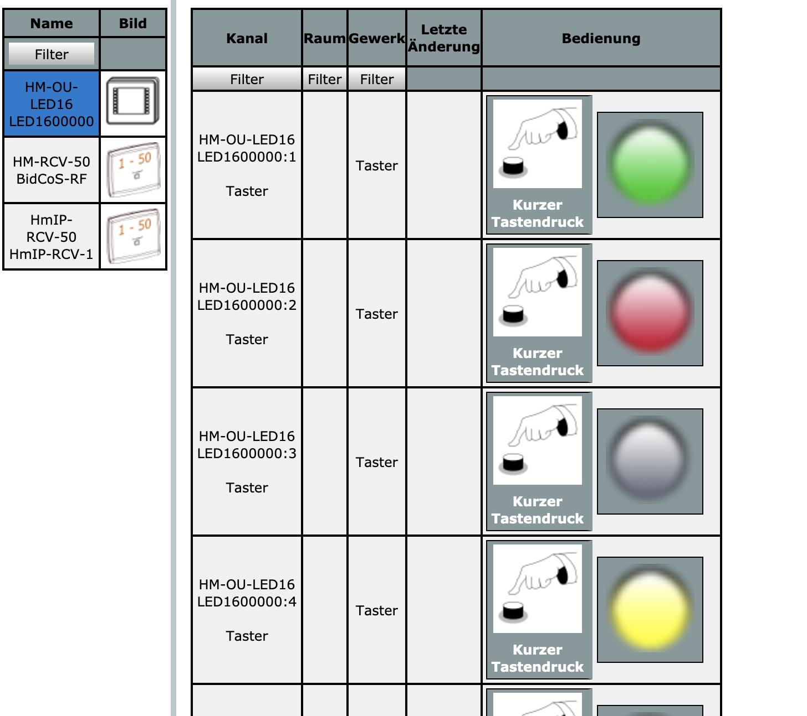

# HM-WebUI-LED16-Mod
WebUI modification to display the LED states of the HM-OU-LED16

Login via SSH and execute the following commands (note: every point is one line with no line breaks): 
- `mount -o remount,rw /` 
- `cd /www/rega/esp/controls/ ; wget --no-check-certificate -q -O - https://raw.githubusercontent.com/jp112sdl/HM-WebUI-CC-Mod/master/patch/buttons.fn.patch | patch buttons.fn` 
- `mount -o remount,ro /` 
- RaspberryMatic: 
 - `monit restart ReGaHss` 
- CCU3 FW: 
 - `/etc/init.d/S70ReGaHss restart` 
  
**At least: clear browser cache!**
 
**Caution: This mod must be applied after every ccu/raspberrymatic firmware update.**

